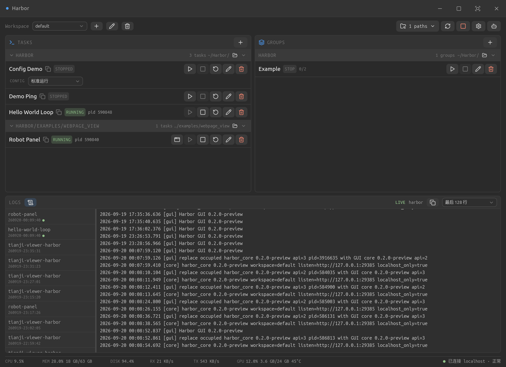

# Harbor

Harbor 是一个面向开发者与 AI Agent 的本地任务管理工具，用统一配置组织、编排和运行工作流。

> 让每个任务，有序启航。

把重复操作沉淀为简单、可复用的 Task 与 Group，在同一个界面中管理本地和远端程序、日志与 Web Panel。

## 下载

从 [GitHub Releases](https://github.com/wh7019025/Harbor/releases) 下载最新 Linux 安装包。

## 文档

- [什么是 Harbor](https://harbor.hyln.space/guide/)
- [快速开始](https://harbor.hyln.space/guide/getting-started/)
- [Work with AI](https://harbor.hyln.space/guide/work-with-ai/)
- [远端运行](https://harbor.hyln.space/guide/remote/)
- [Web Panel](https://harbor.hyln.space/guide/panels/)

## 开发 Harbor

开发环境、架构与构建流程统一维护在官方文档中：

- [设计理念](https://harbor.hyln.space/development/)
- [Harbor 架构](https://harbor.hyln.space/development/architecture/)
- [环境配置](https://harbor.hyln.space/development/environment/)
- [构建 Harbor](https://harbor.hyln.space/development/build/)
